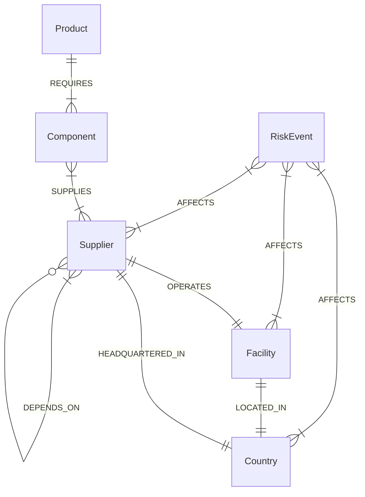

# ChainGuard - Supply Chain Risk & Dependency Explorer

ChainGuard is an advanced supply-chain mapping and risk analysis tool powered by CognoDB (a Neo4j-compatible graph database) and React. It helps procurement and operations teams visualize hidden, multi-tier dependencies, identify single points of failure, and analyze the "blast radius" of active risk events.

## Why a Graph Database?

Modern supply chains are highly interconnected networks, not simple hierarchical tables. We chose CognoDB (Graph Database) for this problem because:
- **Connected Data**: Products depend on components, which are supplied by vendors, operating from facilities, located in countries subject to distinct risks. Graph databases model this reality naturally.
- **Variable-Depth Traversal**: Queries like "Find all upstream dependencies for this product up to 4 hops away" are computationally expensive and awkward with relational recursive CTEs (SQL) but are native, highly optimized graph traversal queries (Cypher).
- **Hidden Dependencies**: Discovering that two completely different product lines secretly share a Tier 3 supplier in a high-risk region is a trivial pattern-matching query (`(p1)-[*]->(s)<-[*]-(p2)`) in a graph.
- **Path Reconstruction**: Calculating the shortest path of failure from a specific risk event to a specific revenue-generating product is a core capability of graph algorithms.

## Data Model (Mermaid)



## Core Cypher Queries
- **Product Neighborhood (`/products/:id/network`)**: Expands up to `N` hops from a target product (`MATCH path = (p:Product)-[*1..4]-(node)`) to map its dependency tree.
- **Risk Impact (`/risks/:id/impact`)**: Matches an active risk event and traverses `AFFECTS` relationships downstream to find all impacted components and ultimately affected products (`MATCH (r:RiskEvent)-[:AFFECTS]->(node)-[*]->(p:Product)`).
- **Shared Dependencies (`/products/compare`)**: Finds intersections where paths from two distinct products converge on the same entity (`MATCH (p1)-[*1..4]->(shared)<-[*1..4]-(p2)`).
- **Single Points of Failure (`/dashboard/single-points-of-failure`)**: Identifies components that have exactly one `SUPPLIES` relationship, highlighting critical bottlenecks.

## Limitations
- **Demonstration Scale**: The seeded data is representative but not at the scale of a global enterprise (tens of thousands of nodes).
- **Illustrative Scoring**: Risk and reliability scores are statically seeded for demonstration purposes, not fed by live intelligence streams.
- **Free-Tier Limits**: Hosted on a free-tier CognoDB instance which may experience cold starts or connection timeouts under heavy concurrent load.

## Local Setup

1. **Database Requirements**: Create a free instance on CognoDB Cloud (or use a local Neo4j Docker container).
2. **Environment Configuration**:
   Create `apps/api/.env`:
   ```env
   NEO4J_URI=bolt+s://<your-instance>.databases.cognodb.cloud
   NEO4J_USERNAME=cognodb
   NEO4J_PASSWORD=<your-password>
   PORT=4000
   WEB_ORIGIN=http://localhost:5173
   ```
   Create `apps/web/.env`:
   ```env
   VITE_API_BASE_URL=http://localhost:4000/api
   ```
3. **Installation & Seeding**:
   ```bash
   npm install
   npm run seed
   npm run verify-db
   ```
4. **Running Locally**:
   ```bash
   npm run dev
   ```

## Live Links
- **GitHub Repository**: [Your Repo Link Here]
- **Frontend Demo**: [Your Vercel Link Here]
- **Backend API**: [Your Render/Heroku Link Here]
- **Health Endpoint**: [Your API Link]/health
- **Screen Recording**: [Your Video Link Here]

## Architecture
```text
React/Vite frontend (React Flow, Tailwind, TanStack Query)
        |
Express/TypeScript API (Zod validation, centralized error handling)
        |
Official Neo4j JavaScript Driver
        |
CognoDB Cloud (Graph Database)
```
